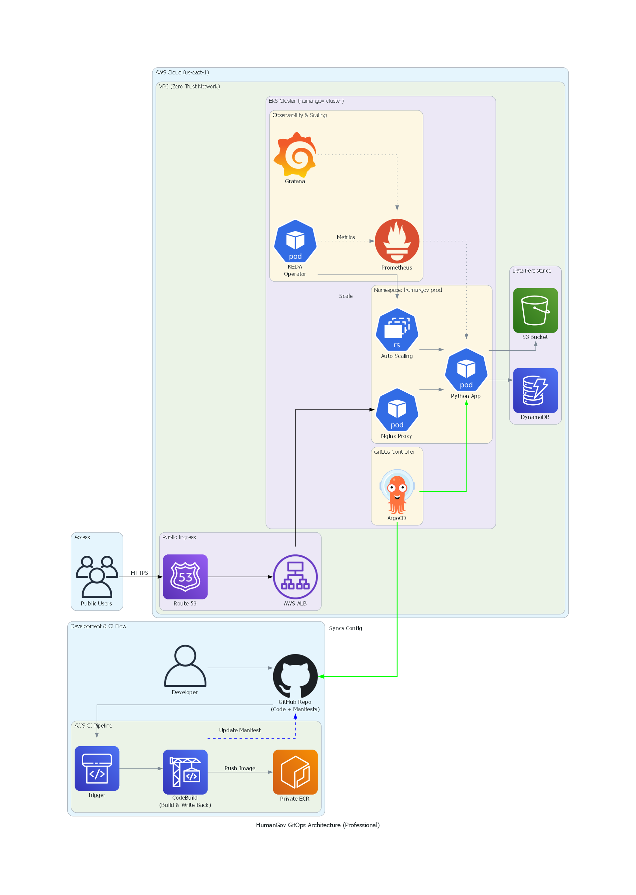

# HumanGov: Enterprise-Grade GitOps Platform on AWS EKS


## 📖 Executive Summary

**HumanGov** is a secure, multi-tenant SaaS Human Resources application designed for government compliance.

This project represents the evolution from traditional DevOps pipelines to a modern **Platform Engineering** architecture. I architected a **Self-Healing, Event-Driven Infrastructure** that leverages **GitOps principles** to manage the entire software lifecycle.

Unlike traditional "Push-based" deployments, this platform utilizes **ArgoCD** as a continuous delivery controller running inside the cluster, ensuring that the live infrastructure always matches the desired state defined in Git ("Single Source of Truth").


Architecture & Design Patterns




The GitOps Workflow (CI-Driven Write-Back)
I implemented a sophisticated **"CI-Driven Write-Back"** pattern to handle immutable artifact propagation:

1.  **Continuous Integration (CodeBuild):**
    *   Detects code changes in GitHub.
    *   Builds the Docker container and pushes it to a **Private Amazon ECR** with an immutable tag (Git SHA).
    *   **Automated Write-Back:** The pipeline programmatically updates the Kubernetes manifest (`kustomization.yaml`) in the GitHub repository with the new image tag and commits the change.
2.  **Continuous Deployment (ArgoCD):**
    *   ArgoCD detects the commit in the configuration repository.
    *   It automatically syncs the **Amazon EKS** cluster to match the new configuration.
    *   **Self-Healing:** If a resource is modified or deleted manually in the cluster, ArgoCD detects the drift and automatically restores the correct state.


Technology Stack

| Domain | Tooling | Implementation Details |
| :--- | :--- | :--- |
| **Infrastructure** | **Terraform** | Modular IaaC provisioning VPC, EKS, IAM, S3, DynamoDB, and ECR. |
| **Orchestration** | **Amazon EKS** | Managed Kubernetes Control Plane (v1.29) with Managed Node Groups. |
| **GitOps / CD** | **ArgoCD** | Declarative continuous delivery using the "App of Apps" pattern. |
| **Config Mgmt** | **Kustomize** | Overlay-based configuration management for isolating **Dev** and **Prod** environments. |
| **Autoscaling** | **KEDA** | Kubernetes Event-Driven Autoscaling based on real-time HTTP metrics. |
| **Observability** | **Prometheus & Grafana** | Full-stack monitoring installed via Helm charts managed by ArgoCD. |
| **Security** | **AWS WAF & Shield** | Layer 7 protection against SQL Injection and DDOS attacks. |
| **Networking** | **AWS ALB Ingress** | Path-based routing managed by the AWS Load Balancer Controller. |


Security & Governance (Zero Trust)

This platform was built with a "Security First" mindset suitable for government workloads.

### 1. Network & Compute Isolation
*   **Private Subnets:** All worker nodes are deployed in private subnets with **no public IP addresses**.
*   **Strict Egress:** Outbound internet access is restricted via NAT Gateways.
*   **WAF Integration:** The Ingress Controller automatically associates AWS WAF Web ACLs to the Application Load Balancer.

### 2. Identity & Access Management (IAM)
*   **IRSA (IAM Roles for Service Accounts):** Eliminated static AWS credentials. Pods authenticate to S3 and DynamoDB using OIDC-federated ephemeral tokens.
*   **Least Privilege:** CI/CD pipelines (CodeBuild) have **Zero Access** to the Kubernetes API. They can only push to ECR and GitHub. Deployment is pulled from *inside* the cluster by ArgoCD.

### 3. Secrets Management
*   **External Secrets:** GitHub Tokens and sensitive configuration data are stored in **AWS Secrets Manager** and retrieved dynamically during the build process.
*   **Immutable Artifacts:** ECR repositories are configured with **Tag Immutability** to prevent image tampering.


Repository Structure (The "App of Apps")

I organized the repository to separate **Application Logic**, **Environment Config**, and **Platform Infrastructure**.

```text
humangov-gitops/
├── buildspec.yml                   # CI Pipeline Logic (Build, Push, Write-Back)
├── humangov_gitops_polished.py     # Architecture-as-Code script
│
├── human-gov-infrastructure/       # Terraform (The Foundation)
│   └── terraform/modules/
│       ├── network/                # VPC & Subnets
│       ├── eks/                    # Cluster & OIDC
│       ├── argocd/                 # GitOps Bootstrap
│       └── cicd/                   # CodePipeline & IAM
│
└── k8s/                            # Kubernetes Manifests (The State)
    ├── base/                       # Generic App Templates
    ├── overlays/                   # Environment Specifics (Kustomize)
    │   ├── dev/                    # Dev Env (Auto-Sync)
    │   └── prod/                   # Prod Env (Manual Promotion)
    └── infrastructure/             # Platform Add-ons
        ├── monitoring/             # Prometheus & Grafana Stack
        └── scaling/                # KEDA Configuration


        Implementation Evidence
1. ArgoCD Dashboard (The Control Plane)
Shows the "App of Apps" pattern managing the Application, KEDA, and Prometheus simultaneously.

2. Observability Stack (Grafana)
Real-time monitoring of cluster CPU, Memory, and Pod health deployed via GitOps.

3. Automated CI/CD Execution
Evidence of CodeBuild pushing the Docker image and programmatically updating the Git repository.

4. Secure Private Networking
AWS Console proof that worker nodes reside in private subnets.
